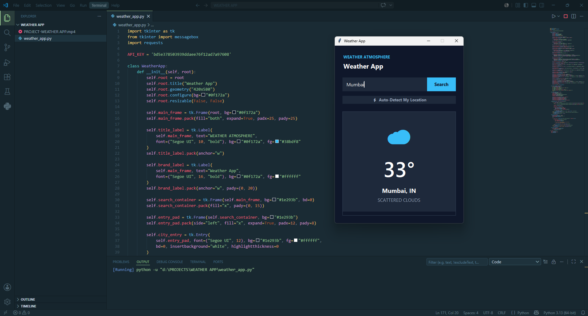
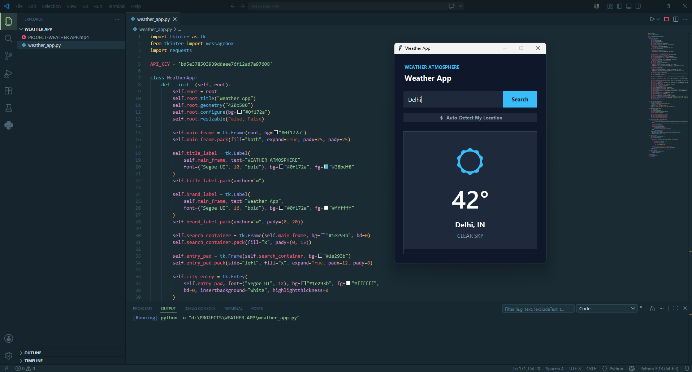

# 🌦️ Weather App

A modern desktop Weather Application built using **Python**, **Tkinter**, and the **OpenWeatherMap API**. The application provides real-time weather updates, automatic location detection, and a clean dark-themed user interface for an enhanced user experience.

---

## 📖 Overview

The Weather App is a Python-based desktop application that allows users to check current weather conditions for any city worldwide. It fetches live weather data from the OpenWeatherMap API and displays important weather metrics such as temperature, humidity, wind speed, and weather conditions.

The application also includes automatic location detection using IP-based geolocation, enabling users to instantly view weather information for their current location when the application starts.

---

## ✨ Features

- 🔍 Search weather by city name
- 📍 Automatic location detection
- 🌡️ Real-time temperature display
- ☁️ Dynamic weather condition icons
- 💧 Humidity monitoring
- 🌬️ Wind speed information
- 🎨 Modern dark-themed user interface
- ⚡ Quick location refresh option
- ❌ Error handling for invalid city names and network issues

---

## 🛠️ Technologies Used

- Python
- Tkinter
- Requests Library
- OpenWeatherMap API
- IP-API Geolocation Service

---

## 📂 Project Structure

```text
Weather-App/
│
├── weather_app.py
├── README.md
│
└── Screenshots/
    ├── Screenshot-1.png
    ├── Screenshot-2.png
    ├── Screenshot-3.png
    └── screen.png
```

---

## 🚀 Installation

### Clone the Repository

```bash
git clone <repository-link>
cd Weather-App
```

### Install Required Dependencies

```bash
pip install requests
```

### Run the Application

```bash
python weather_app.py
```

---

## 🔑 API Configuration

This application uses the OpenWeatherMap API to retrieve real-time weather information.

Current API Key used in the project:

```python
API_KEY = "bd5e378503939ddaee76f12ad7a97608"
```

> ⚠️ **Note:** If this repository is public, it is recommended to regenerate the API key and store it securely using environment variables.

---

## ⚙️ How It Works

### Automatic Location Detection

1. The application starts.
2. User location is detected using IP geolocation.
3. Latitude and longitude coordinates are retrieved.
4. Weather data is requested from OpenWeatherMap.
5. Weather information is displayed on the dashboard.

### Manual Search

1. Enter a city name.
2. Click the **Search** button.
3. The application sends a request to the OpenWeatherMap API.
4. Weather information is fetched and displayed instantly.

---

## 📊 Information Displayed

The application displays the following weather information:

| Parameter | Description |
|------------|-------------|
| 🌡️ Temperature | Current temperature in Celsius |
| ☁️ Weather Condition | Current weather status |
| 📍 Location | City and Country |
| 💧 Humidity | Humidity percentage |
| 🌬️ Wind Speed | Current wind speed |

---

## 📸 Screenshots

### 🏠 Home Screen


---

### 🔍 Weather Search Feature



---

### 📍 Auto Location Detection



---

## 🎯 Future Enhancements

- 5-Day Weather Forecast
- Hourly Weather Updates
- Air Quality Index (AQI)
- Sunrise & Sunset Information
- Weather Maps Integration
- Multiple City Tracking
- Temperature Unit Conversion (°C / °F)
- Weather Notifications
- Improved API Security

---

## 📚 Learning Outcomes

This project helped in understanding:

- GUI Development using Tkinter
- REST API Integration
- JSON Data Processing
- Exception Handling
- Real-Time Data Fetching
- User Interface Design
- Python Desktop Application Development

---

## 👨‍💻 Author

**Sajid Ali**

B.Tech Computer Science and Engineering  
Vellore Institute of Technology (VIT)

### LinkedIn Profile

www.linkedin.com/in/sajid-ali2005

---

## 🔗 LinkedIn Project Post

[View the LinkedIn Post](https://www.linkedin.com/posts/sajid-ali2005_weatherapp-python-tkinter-ugcPost-7469419554197147648-ZLYF/?utm_source=share&utm_medium=member_desktop&rcm=ACoAAF65lLwBKEPFHDUAUEYrcv_2rpi1abK1LPs)

---

## ⭐ Support

If you found this project useful:

- Give this repository a Star ⭐
- Fork the repository 🍴
- Share your feedback 💬
- Connect with me on LinkedIn 🤝

---

## 📜 License

This project is developed for educational and learning purposes. Feel free to use, modify, and improve it for personal, academic, and non-commercial projects.

---

### 💡 Project Highlights

✔ Real-Time Weather Updates  
✔ Automatic Location Detection  
✔ Modern Dark-Themed UI  
✔ API Integration using OpenWeatherMap  
✔ Beginner-Friendly Python Project  
✔ Practical Implementation of Tkinter GUI Development
